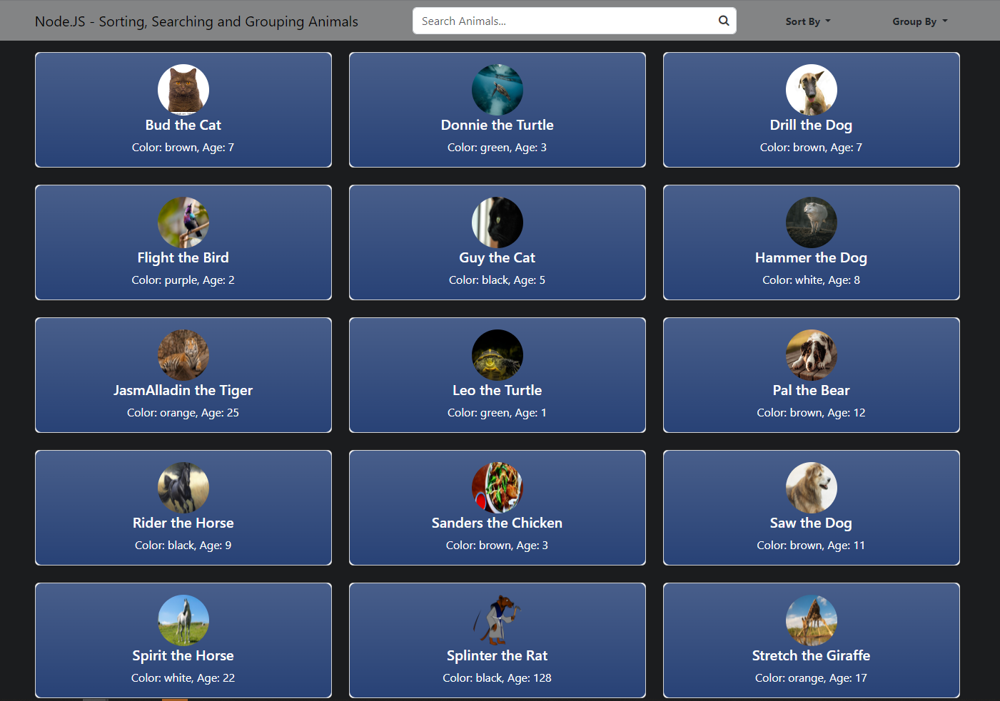
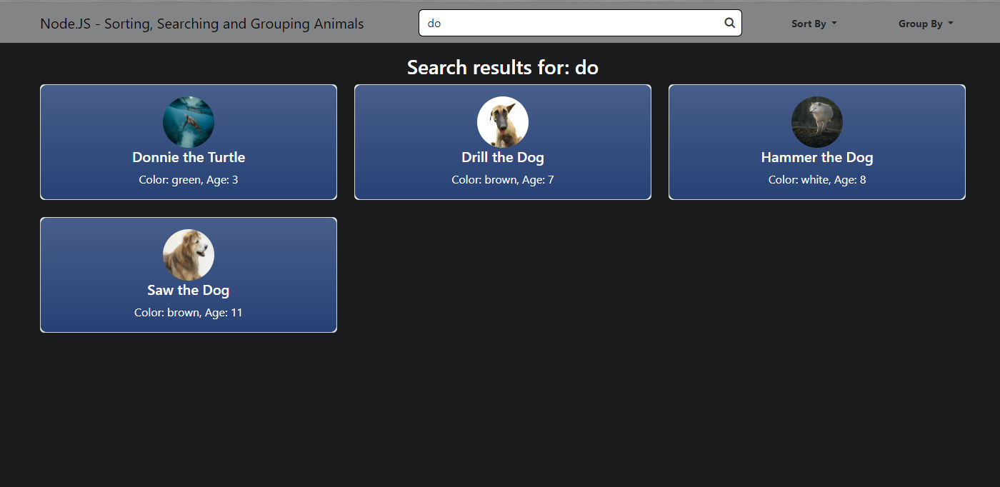
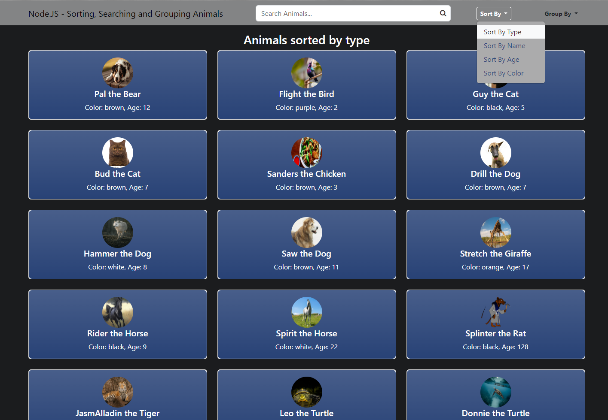
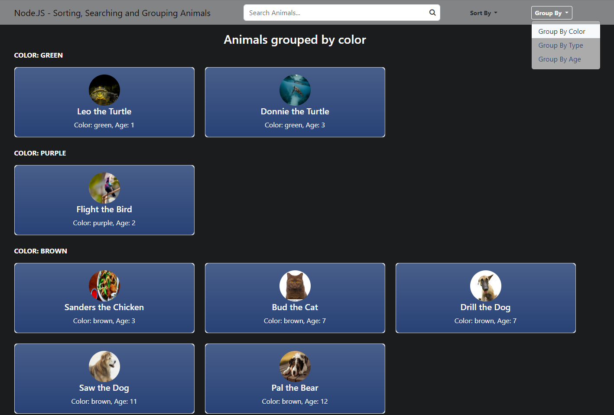

# node-example

## Node.js Example Code

Sorts, Searches and Groups an array of Animal objects dynamically.

## Installation

- Clone/Copy this repository to a Node.js environment
- run ```npm install```
- run ```node app```
- visit ```http://localhost:3000/```

## Page

The home page at ```http://localhost:3000/``` should now appear as



Using the search bar will automatically return tiles matching the search term.
The search searches all fields in an animal object for a match.
Example: Searching 'do' will display "Donnie the Turtle" as well as all dog entries.



Using the Sort By buttons in the nav bar dropdown will sort all animals by the
selected quality.



Using the Group By buttons in the nav bar dropdown will group and display all
animals by the selected quality.



Animals Example:

```
[
  {
    'type': 'Bird',
    'name': 'Flight',
    'color': 'purple',
    'age': 2,
    'img': 'image url'
  },
  {
    'type': 'Cat', 
    'name': 'Bud',
    'color': 'brown',
    'age': 7,
    'img': 'image url'
  },
]
```

~ B Ramey